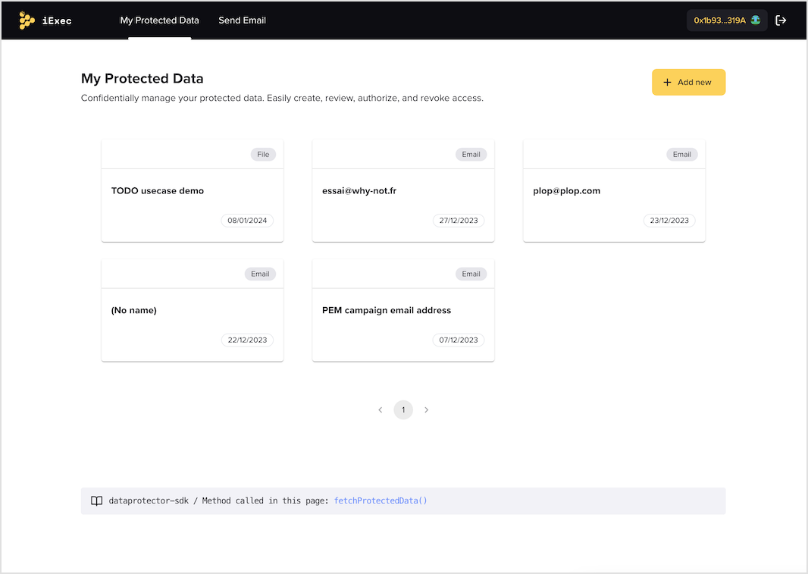

<p align="center">
  <a href="https://iex.ec/" rel="noopener" target="_blank"></a>
</p>

<h1 align="center">Web3Mail demo</h1>

In the Web3 ecosystem, users often rely on blockchain wallets for storing and managing their digital assets. At the same time, these wallets are envisioned to represent users’ digital identity based on their personal information. This means that if a wallet address is linked to a user's identity, their transaction history and holdings can be tracked, posing a huge privacy risk.

We introduce Privacy-enhancing marketing, a novel approach designed to enable communication between Web3 users and decentralized applications (dApps) while prioritizing user privacy and consent. This approach leverages a combination of features that allow for targeted marketing and user engagement without compromising the privacy of individuals. Additionally, these tools empower users to monetize direct marketing actions, creating a more equitable and user-centric ecosystem.

Key Components of Privacy-Enhancing Marketing:

- **User Consent Management**: A user consent mechanism should be in place to ensure that users explicitly authorize the sharing of their personal data with third parties.
- **Secure Data Sharing Protocols**: To facilitate secure data sharing between users and third parties, confidential computing technology should be employed.
- **Privacy-Preserving Communication Channels**: To enable third parties to communicate with users without accessing their personal data directly, privacy-preserving communication channels can be used.
- **Targeted marketing without personal data exposure**: Privacy-enhancing marketing techniques enable targeted marketing campaigns without exposing users' personal data.
- **Monetizing direct marketing actions**: Privacy-enhancing marketing tools can empower users to monetize their engagement with direct marketing campaigns. By participating in targeted marketing efforts, users can earn rewards, such as cryptocurrency or utility tokens, incentivizing users to share their preferences and interests while maintaining control over their privacy.

In summary, privacy-enhancing marketing introduces a new paradigm for communication and user engagement in the Web3 ecosystem. By leveraging cutting-edge privacy-preserving technologies and prioritizing user consent, this approach enables Web3 users and dApps to interact and share information without compromising user privacy. Furthermore, these tools allow users to monetize their involvement in direct marketing actions, fostering a more equitable and user-centric digital environment.
In the next section, we invite you to discover how iExec tools enable Web3 projects to create their own PEM applications or campaigns.

<div align="center">

**[Stable channel v1](https://iex.ec/)**

[](/LICENSE)

</div>

## Tools documentation

[//]: # 'Add link to documentation gitbook when published'

- [documentation](https://docs.iex.ec/tools/overview/use-case-demo/privacy-enhancing-marketing)

## License

This project is licensed under the terms of the
[Apache 2.0](/LICENSE).

<h1 align="center">Run the use case demo</h1>



This project is a simple React TypeScript application bootstrapped with [Vite](https://vitejs.dev/). Vite provides a faster and leaner development experience for modern web projects.

## Prerequisites

Before running this application, make sure you have the following installed:

- [Node.js](https://nodejs.org/) (version 14.0 or later)

## Quick start

First, clone the repository with the following command:

```bash
git clone https://github.com/iExecBlockchainComputing/web3mail-usecase-demo
```

Navigate to the project directory:

```bash
cd web3mail-usecase-demo
```

Install the dependencies:

```bash
npm ci
```

Then, you can run the application in development mode:

```bash
npm run dev
```

Open [http://localhost:3000](http://localhost:5173) to view it in the browser. The page will automatically reload if you make changes to the code.

## Automated tests

To run the automated tests, use the following command:

run the app locally

```bash
npm run dev
```

run the tests in a headless browser

```bash
npm run test:local
```

or open in a browser

```bash
npm run test:open-local
```

## Building for production

To build the application for production, use the following command:

```bash
npm run build
```

This will create a `dist` folder with the compiled assets ready for deployment.

## Learn More

You can learn more about Vite in the [Vite documentation](https://vitejs.dev/guide/).

To learn React, check out the [React documentation](https://reactjs.org/).

For TypeScript, check out the [TypeScript handbook](https://www.typescriptlang.org/docs/).

## In order to run docker

```
docker build -t vite-app .
docker run -p 80:80 vite-app
```
